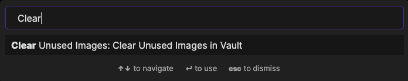
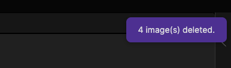
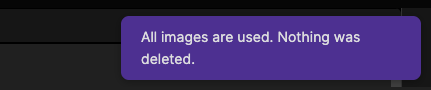
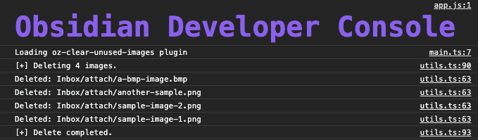

# Obsidian Plugin for Clearing Unused Images

This plugin helps you to delete the images you are not using in your markdown notes anymore. 

It will simply scan all of your markdown documents, find image links you are currently using both wikilinks `![[ ]]` and markdown format `` and compare with all image files you have available in your vault. In case any image is not referenced, it will be deleted.

### How to use

1. Activate the plugin from Community Plugins
1. Simply Open Command Pallette (Using `Ctrl/Cmd + P` or from Ribbon)
2. Run "Clear Unused Images" and that's all.

You will see a notification how many images are deleted from your vault:

In case all images are used, you will see a communication as below:

If you want to check which images are deleted, you can go to console and see the details:

**Scanned Image Formats** : jpg, jpeg, png, gif, svg, bmp

### Support

